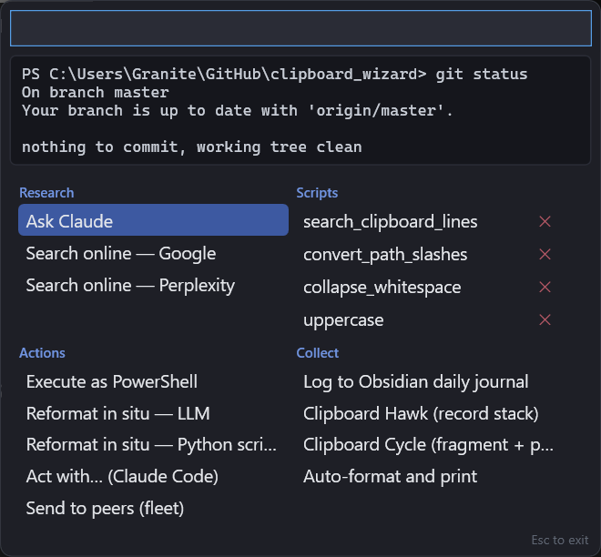
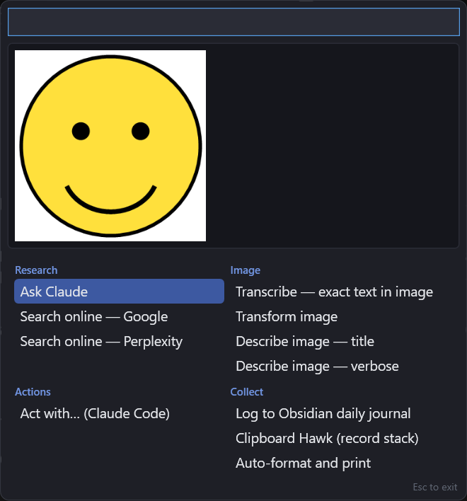

# Clipboard Wizard

A Windows clipboard power-tool. Copying an **image** pops the menu instantly; for text/files a single
copy is silent — **copy the same thing twice** (a second Ctrl+C on the same selection) and a small
command menu pops up at your mouse cursor (clamped to the screen) listing every action available for
what you copied.



When the clipboard holds an image, image operations appear too:



- **Research** — ask an AI about the clipboard: *Ask Claude* (opens interactive Claude Code with a
  "tell me about this" prompt — the default selection, so Enter runs it) and *Search online*
  (Google / Perplexity, incl. reverse-image search).
- **Scripts** — your own Python scripts that transform the clipboard in place (stdin → stdout),
  newest on top. Drop `.py` files in the scripts folder (tray → *Open scripts folder*), or let
  *Reformat in situ — Python script* write one for you. Each has a ✕ to delete it.
- **Image** — operations shown only when the clipboard holds an image or image files:
  transcribe (exact text / OCR), transform (ffmpeg/ImageMagick), gif↔png, jpg→png, and AI describe
  (title / verbose).
- **Actions** — Execute as PowerShell, Reformat in situ (LLM or a saved Python script),
  Act with… (interactive Claude Code), Send to peers (fleet), and more.
- **Collect** — capture modes: Log to Obsidian, Clipboard Hawk (record a stack), Clipboard Cycle
  (fragment + paste), Auto-format and print.

AI features shell out to the **`claude` CLI** (reusing your Claude Code login — no API key needed).

See [the editing guide](claude-instructions-for-editing-project.md) for architecture and the full
command roadmap (what's implemented vs stubbed).

## Requirements

- Windows 10/11
- .NET 8 SDK — `winget install Microsoft.DotNet.SDK.8`
- `python` on PATH (for script commands)
- The `claude` CLI (for the AI commands); optionally Tabby (for *Act with…*) and the fleet (for *Send to peers*)

## Run

```
dotnet run
```

**Or just double-click `launch.cmd`.** It's a self-contained launcher that rebuilds only when a
source file changed, runs hidden, and starts the app detached — so there's no console window left
behind. Pin it or drop a shortcut on your desktop for one-click startup.

The app runs in the system tray (no main window). Right-click the tray icon for a **Verbose** toggle
(runs script/LLM commands in a visible terminal) and **Exit**. Only one instance runs at a time —
launching again takes over the previous one (and asks first if it's mid-command).

To summon the popup for the current clipboard, just **copy the same content again** — a re-copy of
identical content is the trigger, so a normal one-off copy never interrupts you.

## Keyboard

| Key | Action |
|---|---|
| type | filter commands |
| ↑ / ↓ | move selection |
| Enter | run selected command |
| Esc | dismiss |
